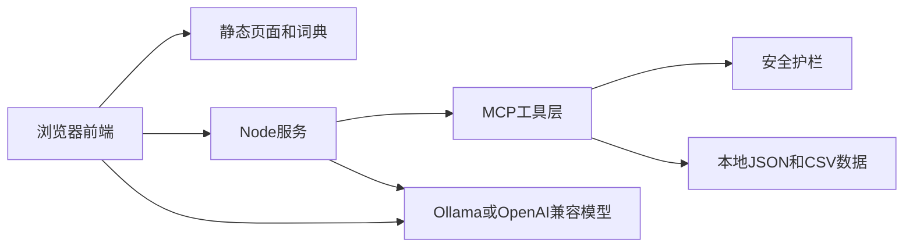

# 系统架构与接口

## 架构

- 浏览器：`main/` 中的单页应用，保存非敏感的界面配置、收藏和学习历史到 `localStorage`。
- Node 服务：`server.js` 提供静态资源、认证、MCP、健康检查和到本地 Ollama 的 `/api/*` 代理。
- MCP 工具层：`server/mcp.js` 提供词典、练习、学习进度、记忆和协同任务。
- 护栏：`server/guardrails.js` 在工具调用前后执行硬规则和可选 AI 审核。
- 数据：用户、会话、记忆及日志在本地 `data/` 与 `logs/`；词典在 `main/read/`。

## 关键接口

| 方法 | 路径 | 用途 |
| --- | --- | --- |
| GET | `/health/security` | 返回 HTTPS、HSTS 与 TLS 配置状态 |
| GET | `/mcp/tools` | 获取工具定义 |
| POST | `/mcp/call` | 以 `{ "tool": "...", "arguments": {} }` 调用工具 |
| POST | `/mcp/guardrail/check` | 检查输入或输出安全性 |
| POST | `/mcp/feedback` | 保存脱敏后的用户反馈 |
| GET | `/mcp/feedback/summary` | 获取当日护栏/反馈汇总 |
| POST | `/auth/register` | 注册 student、parent 或 teacher |
| POST | `/auth/login` | 获取会话令牌 |
| GET | `/auth/me` | 获取当前用户 |
| GET/PUT | `/auth/data` | 读取或更新当前用户学习数据 |

所有 API 响应都附带安全响应头，服务日志中的 `X-Request-ID` 可用于定位同一次请求。请求体、口令、令牌和 API Key 不会写入 `logs/run_log.jsonl`。

## 运行与部署边界

本地运行使用 `npm start`，默认端口为 8080。设置 `SSL_CERT_PATH`、`SSL_KEY_PATH` 后可启用本地 HTTPS；生产环境需要在部署平台配置证书、密钥和模型访问权限。GitHub Pages 工作流仅发布 `main/` 静态目录，因此不包含认证、MCP、日志和模型代理能力。
